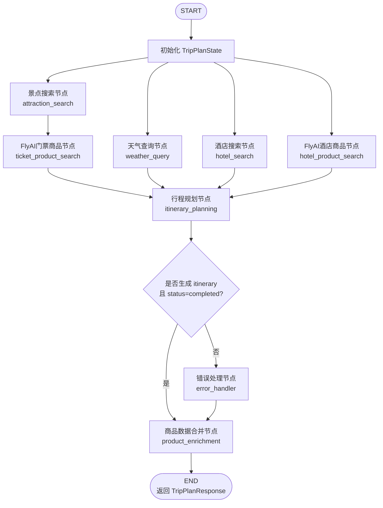

# DanielAgents智能旅行助手 🌍✈️

基于langgraph框架构建的智能旅行规划助手,集成高德地图MCP服务和 FlyAI/飞猪商品增强,提供个性化的旅行计划生成。

## ✨ 功能特点

- 🤖 **AI驱动的旅行规划**: 基于langgraph,智能生成详细的多日旅程
- 🗺️ **高德地图集成**: 通过MCP协议接入高德地图服务,支持景点搜索、路线规划、天气查询
- 🛒 **FlyAI商品增强**: 查询飞猪酒店和景点商品,补充价格、图片、预订链接和门票信息
- 🧠 **智能工具调用**: Agent自动调用高德地图MCP工具,获取实时POI、路线和天气信息
- 🎨 **现代化前端**: Vue3 + TypeScript + Vite,响应式设计,流畅的用户体验
- 📱 **完整功能**: 包含住宿、交通、餐饮和景点游览时间推荐

## 🏗️ 技术栈

### 后端
- **框架**: langgraph
- **API**: FastAPI
- **MCP工具**: `@amap/amap-maps-mcp-server` + `langchain-mcp-adapters`
- **商品增强**: `@fly-ai/flyai-cli`
- **LLM**: 支持多种LLM提供商(OpenAI, DeepSeek等)

### 前端
- **框架**: Vue 3 + TypeScript
- **构建工具**: Vite
- **UI组件库**: Ant Design Vue
- **地图服务**: 高德地图 JavaScript API
- **HTTP客户端**: Axios

## 🔄 LangGraph 工作流

后端旅行规划由 `backend/app/agents/langgraph_planner.py` 构建 StateGraph。收到 `/api/trip/plan` 请求后,系统先初始化旅行状态,并行采集景点、天气、酒店和 FlyAI 酒店商品信息,再查询景点门票商品,最后汇总给行程规划节点生成最终 JSON 行程。



主要节点职责:
- `attraction_search`: 通过高德 MCP `maps_text_search` 搜索景点。
- `weather_query`: 通过高德 MCP `maps_weather` 查询天气预报。
- `hotel_search`: 通过高德 MCP `maps_text_search` 搜索候选酒店。
- `hotel_product_search`: 通过 FlyAI 搜索酒店商品,获取酒店图片、价格和预订链接。
- `ticket_product_search`: 通过 FlyAI 搜索景点商品,获取门票价格、图片和飞猪链接。
- `itinerary_planning`: 汇总上下文并调用 LLM 生成完整多日行程。
- `product_enrichment`: 将 FlyAI 商品信息合并回最终行程,减少单独图片搜索。
- `error_handler`: 在规划失败时收敛错误信息并结束工作流。

## 📁 项目结构

```
helloagents-trip-planner/
├── backend/                    # 后端服务
│   ├── app/
│   │   ├── agents/            # Agent实现
│   │   │   └── langgraph_planner.py
│   │   ├── api/               # FastAPI路由
│   │   │   ├── main.py
│   │   │   └── routes/
│   │   │       ├── trip.py
│   │   │       └── map.py
│   │   ├── services/          # 服务层
│   │   │   ├── amap_service.py
│   │   │   └── llm_service.py
│   │   ├── tools/             # LangChain / MCP / FlyAI 工具适配
│   │   │   ├── amap_mcp_tools.py
│   │   │   └── flyai_tools.py
│   │   ├── models/            # 数据模型
│   │   │   └── schemas.py
│   │   └── config.py          # 配置管理
│   ├── requirements.txt
│   ├── .env.example
│   └── .gitignore
├── frontend/                   # 前端应用
│   ├── src/
│   │   ├── components/        # Vue组件
│   │   ├── services/          # API服务
│   │   ├── types/             # TypeScript类型
│   │   └── views/             # 页面视图
│   ├── package.json
│   └── vite.config.ts
└── README.md
```

## 🚀 快速开始

### 前提条件

- Python 3.10+
- Node.js 20+ 推荐（用于通过 `npx` 启动高德 MCP Server 和运行 FlyAI CLI）
- 高德地图API密钥 (Web服务API)
- LLM API密钥 (OpenAI/DeepSeek等)

### 后端安装

1. 进入后端目录
```bash
cd backend
```

2. 创建虚拟环境
```bash
python -m venv venv
source venv/bin/activate  # Windows: venv\Scripts\activate
```

3. 安装依赖
```bash
pip install -r requirements.txt
```

4. 配置环境变量
```bash
cp .env.example .env
# 编辑.env文件,填入 LLM_API_KEY、LLM_BASE_URL、LLM_MODEL_ID
# 以及 AMAP_MAPS_API_KEY 或 AMAP_API_KEY
```

5. 启动后端服务
```bash
uvicorn app.api.main:app --reload --host 0.0.0.0 --port 8000
```

### 前端安装

1. 进入前端目录
```bash
cd frontend
```

2. 安装依赖
```bash
npm install
```

该步骤会安装前端依赖,同时安装项目内的 `@fly-ai/flyai-cli`。后端会自动查找 `frontend/node_modules/@fly-ai/flyai-cli/dist/flyai-bundle.cjs`,无需全局安装 FlyAI CLI。

3. 配置环境变量
```bash
# 创建.env文件,配置高德地图Web API Key
echo "VITE_AMAP_WEB_KEY=your_amap_web_key" > .env
```

4. 启动开发服务器
```bash
npm run dev
```

5. 打开浏览器访问 `http://localhost:5173`

## 📝 使用指南

1. 在首页填写旅行信息:
   - 目的地城市
   - 旅行日期和天数
   - 交通方式偏好
   - 住宿偏好
   - 旅行风格标签

2. 点击"生成旅行计划"按钮

3. 系统将:
   - Agent自动调用高德地图 MCP 工具搜索景点、酒店和天气
   - FlyAI 查询酒店商品、景点门票、图片和预订链接
   - 整合所有信息生成完整行程

4. 查看结果:
   - 每日详细行程
   - 景点信息与地图标记
   - 交通路线规划
   - 天气预报
   - 餐饮推荐

### MCP工具调用

Agent节点通过 `backend/app/tools/amap_mcp_tools.py` 使用 `langchain-mcp-adapters` 启动官方高德 MCP Server,并将 MCP tools 包装成 LangChain tools。当前旅行规划主链路使用:
- `maps_text_search`: 搜索景点POI
- `maps_weather`: 查询天气

高德 MCP Server 同时还暴露路线和地理编码工具,例如:
- `maps_direction_walking`: 步行路线规划
- `maps_direction_driving`: 驾车路线规划
- `maps_direction_transit_integrated`: 公共交通路线规划
- `maps_geo` / `maps_regeocode`: 地理编码与逆地理编码

### FlyAI 商品增强（可选）

后端可选通过 FlyAI/飞猪商品数据增强酒店和景点结果，用于回填酒店图片、酒店价格、预订链接、景点门票价格和景点图片。该能力适合教学演示“非 MCP 外部工具 + LangGraph 节点”的调用方式。默认关闭，不影响高德 MCP 基础链路。

```bash
# backend/.env
ENABLE_FLYAI=true
FLYAI_CLI=flyai
FLYAI_TIMEOUT=20
```

可使用全局 CLI：

```bash
npm i -g @fly-ai/flyai-cli
flyai search-hotels --dest-name "北京" --key-words "豪华酒店"
```

也可在项目内安装 `@fly-ai/flyai-cli`，后端会优先查找本地 `node_modules/@fly-ai/flyai-cli/dist/flyai-bundle.cjs`。FlyAI 失败时会自动降级为高德 MCP 数据和本地预算估算。

开启后,后端日志会打印 FlyAI 教学链路:

```text
🔎 FlyAI调用开始: search-hotels, params={...}
🔁 FlyAI调用尝试: search-hotels 第1/2次
✅ FlyAI调用成功: search-hotels, items=10
🔎 FlyAI调用开始: search-poi, params={...}
```

如果 FlyAI 偶发返回非完整 JSON 或超时,系统会自动重试一次。连续失败时仅跳过商品增强,不会阻断行程生成:

```text
ℹ️ FlyAI增强跳过: search-poi 连续2次未返回可用数据 (...)
```

## 🔍 LangSmith Tracing（可选）

项目支持通过 LangSmith 记录 LangGraph 和 LangChain 调用链路，便于排查规划节点、工具调用和模型输出。配置方式如下：

```bash
# backend/.env
LANGSMITH_ENABLED=true
LANGSMITH_API_KEY=your_langsmith_api_key
LANGSMITH_PROJECT=daniel-trip-agent
LANGSMITH_ENDPOINT=https://api.smith.langchain.com
# 可选：多 workspace 场景再配置
# LANGSMITH_WORKSPACE_ID=your_workspace_id
```

启用后，后端启动日志会打印 tracing 状态，`GET /health` 也会返回 `langsmith_tracing` 和 `langsmith_project` 字段。

## 📄 API文档

启动后端服务后,访问 `http://localhost:8000/docs` 查看完整的API文档。

主要端点:
- `POST /api/trip/plan` - 生成旅行计划
- `GET /api/map/poi` - 搜索POI
- `GET /api/map/weather` - 查询天气
- `POST /api/map/route` - 规划路线

## 🤝 贡献指南

欢迎提交Pull Request或Issue!

## 📜 开源协议

CC BY-NC-SA 4.0

## 🙏 致谢

- [HelloAgents](https://github.com/datawhalechina/Hello-Agents) - 智能体教程
- [HelloAgents框架](https://github.com/jjyaoao/HelloAgents) - 智能体框架
- [高德地图开放平台](https://lbs.amap.com/) - 地图服务
- [高德地图 MCP Server](https://www.npmjs.com/package/@amap/amap-maps-mcp-server) - 官方高德 MCP 工具服务
- [FlyAI CLI](https://www.npmjs.com/package/@fly-ai/flyai-cli) - 飞猪商品搜索 CLI

---

**DanAgents智能旅行助手** - 让旅行计划变得简单而智能 🌈
