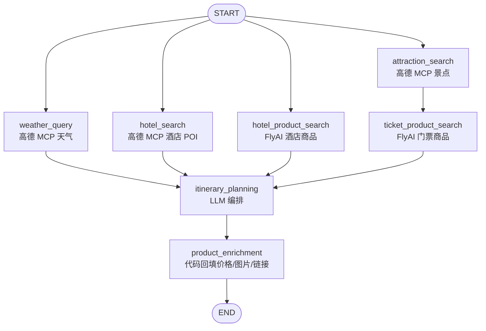

# FlyAI Integration Plan

## 背景与目标

当前旅行规划主链路已经接入高德 MCP，适合处理 POI、天气、地理位置和路线等地图基础数据。但酒店价格、酒店图片、景点门票价格、预订链接等“交易型旅行商品数据”仍不稳定：酒店搜索容易混入低价住宿，景点门票多为估算，图片依赖 Unsplash，存在不准确的问题。

FlyAI skill 通过 `@fly-ai/flyai-cli` 调用飞猪 MCP，可补充酒店商品、景点门票、图片和预订链接。目标是把 FlyAI 作为可选增强数据源，而不是替代高德 MCP。

## 能力边界

高德 MCP 继续负责：

- 景点 POI 搜索、地址、坐标、类型。
- 天气查询。
- 后续路线规划和地理编码。

FlyAI 负责：

- 酒店商品搜索：名称、价格、图片、详情页链接。
- 景点门票搜索：门票价格、图片、购买链接。
- 可选扩展：机票、火车、活动、演出。

LLM 只负责行程编排和自然语言描述，不负责编造价格、图片或链接。

## 推荐架构

新增两个商品增强节点：



这样做有两个好处：

- 保持高德 MCP 教学链路清晰。
- FlyAI 网络失败时只影响商品增强，不阻塞基础行程生成。

## 后端改造方案

### 1. 新增 FlyAI 工具封装

新增文件：

```text
backend/app/tools/flyai_tools.py
```

职责：

- 检查本机是否安装 `flyai` CLI。
- 调用 `search-hotels`、`search-poi` 等 FlyAI CLI 命令。
- 解析单行 JSON 输出。
- 归一化为项目内部结构。
- 设置超时，失败时返回空列表，不抛出致命异常。

建议接口：

```python
async def search_hotel_products(city: str, accommodation: str, check_in: str, check_out: str) -> list[dict]:
    ...

async def search_ticket_products(city: str, attraction_names: list[str]) -> list[dict]:
    ...
```

### 2. 扩展 LangGraph State

在 `backend/app/agents/state.py` 增加：

```python
hotel_products: List[Dict]
ticket_products: List[Dict]
```

这两个字段保存 FlyAI 原始归一化结果，供最终规划和回填节点使用。

### 3. 新增节点

新增：

```text
backend/app/agents/nodes/hotel_product_node.py
backend/app/agents/nodes/ticket_product_node.py
backend/app/agents/nodes/product_enrichment_node.py
```

节点职责：

- `hotel_product_search`: 根据城市、住宿偏好、日期搜索酒店商品。
- `ticket_product_search`: 根据高德 MCP 返回的景点名称搜索门票商品。
- `product_enrichment`: LLM 生成行程后，用确定性匹配回填图片、价格和链接。

关键点：商品数据回填应由代码完成，不让 LLM 自己决定价格。

### 4. 扩展响应模型

在 `backend/app/models/schemas.py` 中建议新增字段：

```python
class Attraction(BaseModel):
    image_url: Optional[str] = None
    booking_url: Optional[str] = None
    source: Optional[str] = None

class Hotel(BaseModel):
    image_url: Optional[str] = None
    booking_url: Optional[str] = None
    source: Optional[str] = None
```

已有 `Attraction.image_url` 可以复用，但缺少 `booking_url` 和 `source`。酒店模型需要补充 `image_url` 和 `booking_url`。

### 5. 调整预算计算

门票预算优先级：

1. FlyAI 门票商品价格。
2. LLM 输出的 `ticket_price`。
3. 后端 fallback 估算。

酒店预算优先级：

1. FlyAI 酒店商品价格。
2. 住宿偏好档位估算。

预算最终由代码重新计算，避免 LLM 输出和商品数据不一致。

## 前端改造方案

### 1. 景点图片

当前结果页会逐个请求：

```text
GET /api/poi/photo?name=...&city=...
```

调整为优先使用后端返回的 `image_url`：

```ts
if (item.image_url) return item.image_url
if (attractionPhotos.value[name]) return attractionPhotos.value[name]
return placeholder
```

这样 FlyAI 有图时不再查 Unsplash，只有缺图时才 fallback。

### 2. 酒店图片和预订链接

酒店卡片增加：

- 酒店图片：`hotel.image_url`
- 预订按钮：`hotel.booking_url`
- 数据来源：`hotel.source`

示例展示：

```text
酒店名称
价格范围 / 评分 / 地址
[查看详情或预订]
来源：FlyAI
```

### 3. 景点门票链接

景点卡片增加：

- 门票价格继续显示在图片角标。
- 若有 `booking_url`，显示“查看门票”按钮。
- 若无链接，保持当前展示。

## 配置与依赖

新增 `.env.example`：

```env
ENABLE_FLYAI=false
FLYAI_TIMEOUT=20
FLYAI_CLI=flyai
```

FlyAI CLI 不建议在运行时动态安装。生产或课堂演示可以二选一：

1. 全局安装 CLI：

```bash
npm i -g @fly-ai/flyai-cli
flyai --help
flyai search-hotels --dest-name "北京" --key-words "豪华酒店"
```

2. 项目内固定依赖版本，并用 Node bundle 执行：

```bash
npm install @fly-ai/flyai-cli
node node_modules/@fly-ai/flyai-cli/dist/flyai-bundle.cjs search-hotels --dest-name "北京"
```

如果需要增强结果，可选配置：

```bash
flyai config set FLYAI_API_KEY "your-key"
```

## 失败策略

FlyAI 是增强源，必须可降级：

- CLI 未安装：记录 warning，返回空商品列表。
- FlyAI 超时：记录 warning，继续使用高德 MCP 和估算价格。
- 返回 JSON 格式异常：记录 warning，跳过该条。
- 没有匹配商品：保留现有高德 POI 和 fallback 估算。

用户不应因为 FlyAI 失败而无法生成行程。

## 匹配策略

酒店匹配：

- 优先按酒店名称相似度匹配。
- 对豪华酒店过滤青年旅舍、客栈、民宿、公寓、招待所。
- 如果 FlyAI 返回商品足够可信，最终酒店可优先使用 FlyAI 商品而不是高德 POI。

景点门票匹配：

- 使用景点名称精确匹配。
- 再使用去除括号、空格、行政区后缀的简化名称匹配。
- 只把价格和链接回填到已在行程中的景点，不额外新增景点。

## 实施步骤

1. 增加配置项和 FlyAI CLI 可用性检测。
2. 新增 `flyai_tools.py`，实现酒店和门票搜索封装。
3. 扩展 `TripPlanState`、`Attraction`、`Hotel` 模型。
4. 新增 `hotel_product_search` 和 `ticket_product_search` 节点。
5. 新增 `product_enrichment` 节点，负责回填价格、图片、链接并重算预算。
6. 修改前端结果页，优先显示后端返回图片和预订链接。
7. 保留 Unsplash 作为最后 fallback。
8. 增加 smoke test：FlyAI 未安装、FlyAI 超时、FlyAI 有结果三种场景。

## 风险与注意事项

- FlyAI CLI 是外部 npm 包，安装前需要确认来源和版本。
- 商品价格和库存是实时数据，页面应标注“以预订页为准”。
- 预订链接可能跳转第三方平台，不应在后端自动下单。
- 教学项目建议默认 `ENABLE_FLYAI=false`，课堂演示时再开启。
- 如果 FlyAI 请求耗时长，应避免把它放在关键路径；可先生成行程，再异步增强商品数据。

## 推荐落地优先级

第一阶段：

- 接入酒店商品搜索。
- 酒店图片、价格、预订链接进入结果页。
- 禁止 Unsplash 覆盖 FlyAI 图片。

第二阶段：

- 接入景点门票商品搜索。
- 回填 `ticket_price`、`image_url`、`booking_url`。
- 预算由后端重新计算。

第三阶段：

- 增加机票、火车等入口。
- 支持用户从结果页点击商品链接查看预订。
