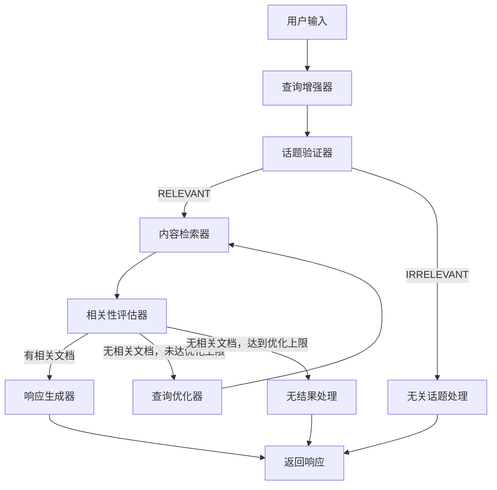

# 工业设备售后智能客服 RAG Agent

基于 LangGraph Platform 的高级 RAG Agent 系统，为电机等工业设备提供智能售后客服对话服务。使用 LangGraph Server 作为后端，Agent Chat UI 作为前端。

## 系统架构

```
┌─────────────────────────────────────────────────────────────────┐
│               Agent Chat UI 前端 (端口 3000)                     │
│           langchain-ai/agent-chat-ui (Next.js)                  │
└─────────────────────────────────────────────────────────────────┘
                              │
                              ▼
┌─────────────────────────────────────────────────────────────────┐
│                LangGraph Server (端口 2024)                      │
│          langgraph dev - 本地开发服务器                           │
│          自动注入 Checkpointer / 线程管理 / SSE 流式             │
└─────────────────────────────────────────────────────────────────┘
                              │
                              ▼
┌─────────────────────────────────────────────────────────────────┐
│                   LangGraph 工作流引擎                            │
│  ┌──────────┐  ┌──────────┐  ┌──────────┐  ┌──────────┐        │
│  │ 查询增强  │→ │ 话题验证 │→ │ 内容检索 │→ │相关性评估│        │
│  └──────────┘  └──────────┘  └──────────┘  └──────────┘        │
│       │              │              │              │             │
│       ▼              ▼              ▼              ▼             │
│  ┌──────────┐  ┌──────────┐  ┌──────────┐  ┌──────────┐        │
│  │ 边情况   │  │ 查询优化 │← │ 生成响应 │← │ 路由决策 │        │
│  │ 处理     │  │ (循环)   │  │          │  │          │        │
│  └──────────┘  └──────────┘  └──────────┘  └──────────┘        │
└─────────────────────────────────────────────────────────────────┘
                              │
                              ▼
┌─────────────────────────────────────────────────────────────────┐
│                  Chroma 向量数据库                               │
│              电机售后知识库（10条示例数据）                        │
└─────────────────────────────────────────────────────────────────┘
```

## 技术栈

| 层级 | 技术 |
|------|------|
| 前端 | Agent Chat UI (Next.js) |
| 后端 | LangGraph Server + LangChain |
| LLM | OpenAI-compatible API (`gpt-4o-mini` by default) |
| Embedding | OpenAI-compatible API (`text-embedding-3-small` by default) |
| 向量数据库 | ChromaDB |
| 状态管理 | LangGraph `add_messages` reducer + Server 自动注入 Checkpointer |

## 工作流程



## 功能特点

1. **智能查询增强**：将上下文相关的对话改写为自包含的优化查询
2. **话题验证**：判断问题是否属于工业设备领域
3. **向量检索**：基于语义相似度检索知识库
4. **相关性评估**：用 LLM 评估文档是否真正相关
5. **自适应查询优化**：检索不佳时自动优化查询策略
6. **多轮对话**：LangGraph Server 自动管理线程和 Checkpointer，支持上下文感知

## 项目结构

```
industrial-rag-agent/
├── langgraph.json              # LangGraph Platform 配置
├── backend/
│   ├── agent.py                # LangGraph 入口（导出 graph）
│   ├── config/settings.py      # 集中配置
│   ├── logging/config.py       # 日志配置
│   ├── models/
│   │   ├── state.py            # ConversationState（messages + add_messages）
│   │   └── providers.py        # LLM / Embedding 提供者
│   ├── nodes/                  # 工作流处理节点
│   │   ├── enhancer.py         # 查询增强器
│   │   ├── validator.py        # 话题验证器
│   │   ├── retriever.py        # 内容检索器
│   │   ├── assessor.py         # 相关性评估器
│   │   ├── generator.py        # 响应生成器
│   │   ├── optimizer.py        # 查询优化器
│   │   ├── handlers.py         # 边情况处理
│   │   └── utils.py            # 辅助函数（content 格式处理）
│   ├── workflow/builder.py     # LangGraph 工作流编排
│   └── knowledge/
│       ├── base.py             # 知识库初始化与检索器
│       └── chroma_db/          # ChromaDB 持久化数据
├── agent-chat-ui/              # Agent Chat UI 前端（Next.js）
│   └── .env                    # 前端配置（NEXT_PUBLIC_API_URL 等）
├── logs/                       # 运行日志
└── .env                        # 后端配置（API Key 等）
```

## 快速开始

### 1. 环境准备

确保已安装：
- Python 3.10+
- Node.js 18+
- 可访问 OpenAI 兼容 API，并准备好 `OPENAI_API_KEY`

### 2. 配置环境变量

```bash
cd industrial-rag-agent

# 后端配置
cat > .env <<'EOF'
OPENAI_API_KEY="your-api-key"
LLM_MODEL="gpt-4o-mini"
EMBEDDING_MODEL="text-embedding-3-small"
EOF
```

### 3. 启动后端（LangGraph Server）

```bash
# 安装依赖
pip install -r backend/requirements.txt

# 启动 LangGraph 开发服务器
langgraph dev
```

后端运行在 `http://localhost:2024`，graph ID 为 `industrial_rag`。

### 4. 启动前端（Agent Chat UI）

```bash
cd agent-chat-ui

# 安装依赖
npm install

# 启动开发服务器
npm run dev
```

前端运行在 `http://localhost:3000`，已预配置连接本地 LangGraph Server。

### 5. 测试对话

打开浏览器访问 http://localhost:3000

示例问题：
- "Y系列电机有哪些规格？"
- "电机无法启动怎么办？"
- "电机过热怎么处理？"
- "轴承怎么更换？"
- "保修政策是什么？"

## 知识库内容（10条）

| 编号 | 类别 | 主题 |
|------|------|------|
| 1 | 产品规格 | Y系列三相异步电机规格参数 |
| 2 | 安装调试 | 电机安装与调试指南 |
| 3 | 故障排查 | 电机无法启动故障排查 |
| 4 | 故障排查 | 电机过热原因分析 |
| 5 | 故障排查 | 电机振动异常处理 |
| 6 | 维护保养 | 电机日常维护保养规范 |
| 7 | 故障代码 | 变频器故障代码解读 |
| 8 | 配件更换 | 电机轴承更换指南 |
| 9 | 保修政策 | 产品保修条款与流程 |
| 10 | 售后服务 | 售后服务流程与联系方式 |

## 配置说明

### 后端配置（`.env`）

```env
# LLM 配置
OPENAI_API_KEY="your-api-key"
# 可选：使用兼容 OpenAI SDK 的第三方服务时配置
OPENAI_BASE_URL="https://api.openai.com/v1"
LLM_MODEL="gpt-4o-mini"

# Embedding 配置
EMBEDDING_MODEL="text-embedding-3-small"

# 向量数据库
CHROMA_PERSIST_DIR="./backend/knowledge/chroma_db"

# 日志
LOG_LEVEL="DEBUG"
LOG_FILE="./logs/app.log"
```

### 前端配置（`agent-chat-ui/.env`）

```env
NEXT_PUBLIC_API_URL=http://localhost:2024
NEXT_PUBLIC_ASSISTANT_ID=industrial_rag
```

### LangGraph 配置（`langgraph.json`）

```json
{
  "dependencies": ["."],
  "graphs": {
    "industrial_rag": "./backend/agent.py:graph"
  },
  "env": ".env"
}
```
