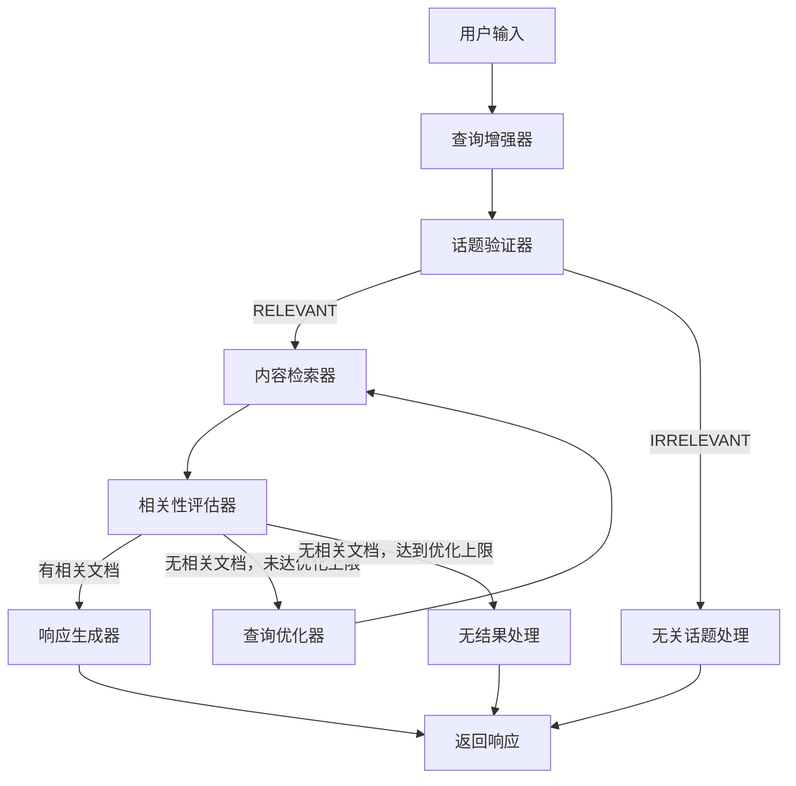
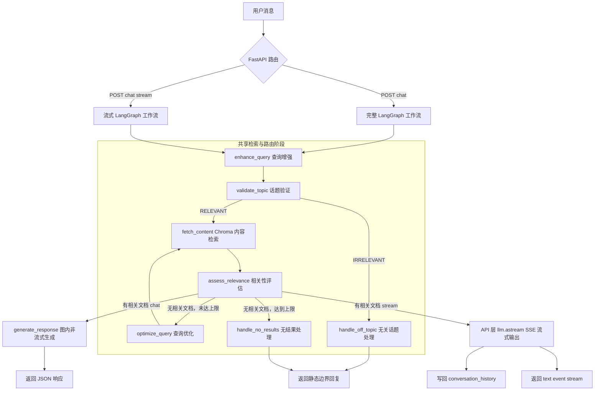

# 工业设备售后智能客服 RAG Agent

基于 LangGraph 的高级 RAG Agent 系统，为电机等工业设备提供智能售后客服对话服务。

## 系统架构

```
┌─────────────────────────────────────────────────────────────────┐
│                        React 前端 (端口 3000)                     │
│                  工业技术风格对话界面                              │
└─────────────────────────────────────────────────────────────────┘
                              │
                              ▼
┌─────────────────────────────────────────────────────────────────┐
│                      FastAPI 后端 (端口 8000)                     │
│                       /api/chat 对话接口                          │
└─────────────────────────────────────────────────────────────────┘
                              │
                              ▼
┌─────────────────────────────────────────────────────────────────┐
│                   LangGraph 工作流引擎                            │
│  ┌──────────┐  ┌──────────┐  ┌──────────┐  ┌──────────┐        │
│  │ 查询增强  │→ │ 话题验证 │→ │ 内容检索 │→ │相关性评估│        │
│  └──────────┘  └──────────┘  └──────────┘  └──────────┘        │
│       │              │              │              │             │
│       ▼              ▼              ▼              ▼             │
│  ┌──────────┐  ┌──────────┐  ┌──────────┐  ┌──────────┐        │
│  │ 边情况   │  │ 查询优化 │← │ 生成响应 │← │ 路由决策 │        │
│  │ 处理     │  │ (循环)   │  │         │  │         │        │
│  └──────────┘  └──────────┘  └──────────┘  └──────────┘        │
└─────────────────────────────────────────────────────────────────┘
                              │
                              ▼
┌─────────────────────────────────────────────────────────────────┐
│                  Chroma 向量数据库                               │
│              电机售后知识库（10条示例数据）                        │
└─────────────────────────────────────────────────────────────────┘
```

## 技术栈

| 层级 | 技术 |
|------|------|
| 前端 | React 18 + TypeScript + Vite |
| 后端 | FastAPI + LangChain + LangGraph |
| LLM | OpenAI-compatible API (`gpt-4o-mini` by default) |
| Embedding | OpenAI-compatible API (`text-embedding-3-small` by default) |
| 向量数据库 | ChromaDB |
| 日志 | structlog |

## 工作流程



### LangGraph 整体图

当前后端包含两个 LangGraph 编排：`/api/chat` 使用完整非流式图，`/api/chat/stream` 使用流式专用图。两者共享查询增强、话题验证、检索、相关性评估和查询优化节点；区别是流式接口不会在图内执行最终生成，而是把相关文档交给 API 层用 `llm.astream()` 推送 SSE。



## 功能特点

1. **智能查询增强**：将上下文相关的对话改写为自包含的优化查询
2. **话题验证**：判断问题是否属于工业设备领域
3. **向量检索**：基于语义相似度检索知识库
4. **相关性评估**：用LLM评估文档是否真正相关
5. **自适应查询优化**：检索不佳时自动优化查询策略
6. **上下文感知**：支持多轮对话，理解指代和省略

## 项目结构

```
industrial-rag-agent/
├── backend/
│   ├── config/settings.py      # 集中配置
│   ├── logging/config.py       # 日志配置
│   ├── models/state.py         # ConversationState
│   ├── nodes/                  # 处理节点
│   │   ├── enhancer.py         # 查询增强器
│   │   ├── validator.py        # 话题验证器
│   │   ├── retriever.py        # 内容检索器
│   │   ├── assessor.py         # 相关性评估器
│   │   ├── generator.py        # 响应生成器
│   │   ├── optimizer.py        # 查询优化器
│   │   └── handlers.py         # 边情况处理
│   ├── workflow/builder.py     # LangGraph工作流
│   ├── knowledge/base.py       # 知识库
│   ├── api/routes.py           # FastAPI路由
│   └── main.py                 # 应用入口
├── frontend/                   # React 前端
│   ├── src/
│   │   ├── components/ChatWindow.tsx
│   │   ├── App.tsx
│   │   └── main.tsx
│   └── vite.config.ts          # Vite配置
├── logs/app.log                # 日志文件
└── README.md
```

## 快速开始

### 1. 环境准备

确保已安装：
- Python 3.10+
- Node.js 18+
- 可访问 OpenAI 兼容 API，并准备好 `OPENAI_API_KEY`

### 2. 后端设置

```bash
cd industrial-rag-agent
cd backend

# 创建虚拟环境
python -m venv venv
source venv/bin/activate  # Windows: venv\Scripts\activate

# 安装依赖
pip install -r requirements.txt

# 配置模型 API
cat > ../.env <<'EOF'
OPENAI_API_KEY="your-api-key"
LLM_MODEL="gpt-4o-mini"
EMBEDDING_MODEL="text-embedding-3-small"
EOF

# 启动后端
cd ..
python -m backend.main
```

后端运行在 `http://localhost:8000`

### 3. 前端设置

```bash
cd frontend

# 安装依赖
npm install

# 启动开发服务器
npm run dev
```

前端运行在 `http://localhost:3000`

### 4. 测试对话

打开浏览器访问 http://localhost:3000

示例问题：
- "Y系列电机有哪些规格？"
- "电机无法启动怎么办？"
- "电机过热怎么处理？"
- "轴承怎么更换？"
- "保修政策是什么？"

## 日志配置

所有模块的日志统一输出到 `logs/app.log`，日志格式：

```
2024-01-08 10:30:45 | DEBUG    | backend.nodes.enhancer:35 | 增强查询: 电机无法启动
2024-01-08 10:30:45 | INFO     | backend.nodes.validator:52 | 话题分类: RELEVANT
2024-01-08 10:30:46 | INFO     | backend.nodes.retriever:23 | 检索到 2 篇文档
```

## 知识库内容（10条）

| 编号 | 类别 | 主题 |
|------|------|------|
| 1 | 产品规格 | Y系列三相异步电机规格参数 |
| 2 | 安装调试 | 电机安装与调试指南 |
| 3 | 故障排查 | 电机无法启动故障排查 |
| 4 | 故障排查 | 电机过热原因分析 |
| 5 | 故障排查 | 电机振动异常处理 |
| 6 | 维护保养 | 电机日常维护保养规范 |
| 7 | 故障代码 | 变频器故障代码解读 |
| 8 | 配件更换 | 电机轴承更换指南 |
| 9 | 保修政策 | 产品保修条款与流程 |
| 10 | 售后服务 | 售后服务流程与联系方式 |

## API 接口

### POST /api/chat

对话接口

**请求体：**
```json
{
  "message": "电机无法启动怎么办？",
  "thread_id": "session_123"
}
```

**响应：**
```json
{
  "response": "您好！电机无法启动可能有以下原因...",
  "thread_id": "session_123"
}
```

### GET /api/health

健康检查

## 配置说明

在 `.env` 文件中配置：

```env
# LLM 配置
OPENAI_API_KEY="your-api-key"
# 可选：使用兼容 OpenAI SDK 的第三方服务时配置
OPENAI_BASE_URL="https://api.openai.com/v1"
LLM_MODEL="gpt-4o-mini"

# Embedding 配置
EMBEDDING_MODEL="text-embedding-3-small"

# 向量数据库
CHROMA_PERSIST_DIR="./backend/knowledge/chroma_db"

# 日志
LOG_LEVEL="DEBUG"
LOG_FILE="./logs/app.log"
```
