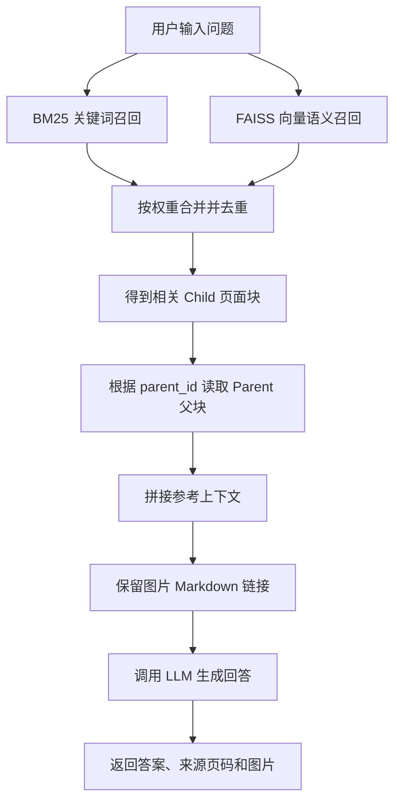

# PPTX-RAG 问答说明

## 1. 这个项目如何启动？

进入项目目录，安装依赖后启动 Streamlit：

```bash
cd /Users/danielhe/enviroment/server/workspace/daniel-langraph/pptx-rag
python -m venv venv
source venv/bin/activate
pip install -r requirements.txt
streamlit run app/streamlit_app.py
```

启动后访问 `http://localhost:8501`。需要提前配置 `.env`，至少包含 `API_BASE_URL`、`API_KEY`、`LLM_MODEL` 和 `EMBEDDING_MODEL`。

## 2. `PLC故障判断培训.pptx` 适合问哪些问题？

可以用以下问题验证检索和图片召回：

- `PLC系统中 S7-200 和 S7-300 系列分别用在哪些设备上？请结合图片说明它们的主要模块和指示灯。`
- `PLC运行故障诊断时，需要重点查看哪些指示灯？如果有相关示意图，请一起展示。`
- `PLC电源故障诊断应该关注哪些位置？请引用文档中的图片辅助说明。`
- `PLC系统架构示例包含哪些组成部分？请按第14到16页的内容总结，并保留相关架构图片。`
- `当机台启动后，如何通过输入输出指示灯判断是PLC模块问题还是现场连接问题？`

## 3. 用户提问后的查询逻辑是什么？

用户输入问题后，系统先做混合检索，再生成回答：



核心思路是：**检索用子块，回答用父块**。

## 4. BM25 + FAISS 双路召回的权重如何配置？

权重可以配置。默认来自 `.env`：

```env
BM25_WEIGHT=0.4
VECTOR_WEIGHT=0.6
```

BM25 权重越高，越偏向关键词精确匹配；向量权重越高，越偏向语义相似匹配。Streamlit 页面也支持运行时调整这两个权重。

## 5. BM25 是什么意思？

BM25 是一种关键词检索算法，可以理解为高级关键词匹配。它会看用户问题里的词是否出现在文档中、出现频率如何、这个词是否有区分度。

例如问题是：

```text
ERROR灯亮是什么意思？
```

BM25 会优先召回包含 `ERROR灯`、`亮`、`故障` 等关键词的页面。它适合型号、编号、指示灯名称等精确术语。

## 6. FAISS 向量语义召回是什么意思？

FAISS 是向量检索库。系统会把文档页面和用户问题都转换成 embedding 向量，再查找语义最接近的页面。

它不要求字面词完全一致。例如用户问：

```text
PLC不能正常运行时应该先检查什么？
```

即使文档写的是 `运行故障诊断：查看RUN灯、ERROR灯、SF灯、PROG灯、ALARM灯`，向量检索也可能判断二者语义相近并召回相关页面。

## 7. 现在只有 PPT 会提取图片吗？PDF 图片会提取吗？

当前实现里，只有 PPT/PPTX 会做内嵌图片提取。`PptxParser` 会调用 `ImageHandler.extract(...)`，把图片保存到 `data/images/` 并插入 Markdown 图片链接。

PDF 当前只提取文本：

```python
text = page.get_text("text").strip()
```

`PDFParser` 返回的 `images` 为空，所以 PDF 里的内嵌图片暂时不会被提取，也不会在回答里展示。

## 8. 用户询问时，图片是通过什么被召回的？

图片不是单独检索的，而是跟随页面内容一起召回。

处理 PPT 时，图片链接会被写进对应页面 chunk：

```markdown

```

用户提问时，系统召回相关页面子块，再通过 `parent_id` 找到父块。父块内容里包含这些 Markdown 图片链接，Prompt 要求 LLM 原样保留，因此前端可以渲染图片。

当前项目没有单独的图片向量检索，图片召回依赖对应页面文本是否被召回。

## 9. 父块和子块是如何关联的？

父块和子块通过 `parent_id` 关联。

- `PageChunk`：单页子块，存入 FAISS，用来检索。
- `ParentChunk`：连续多页父块，存入 `data/chunks/*.json`，用来回答。

父块记录自己包含哪些子块：

```json
{
  "id": "dc6e234e_parent_17_19",
  "child_chunk_ids": ["dc6e234e_17", "dc6e234e_18", "dc6e234e_19"]
}
```

子块 metadata 记录自己属于哪个父块：

```json
{
  "id": "dc6e234e_17",
  "metadata": {
    "parent_id": "dc6e234e_parent_17_19"
  }
}
```

用户提问时先召回子块，再用 `parent_id` 读取父块，把更完整的上下文交给 LLM。
