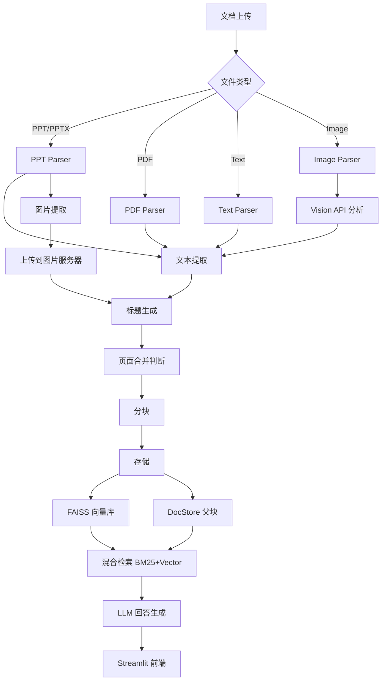
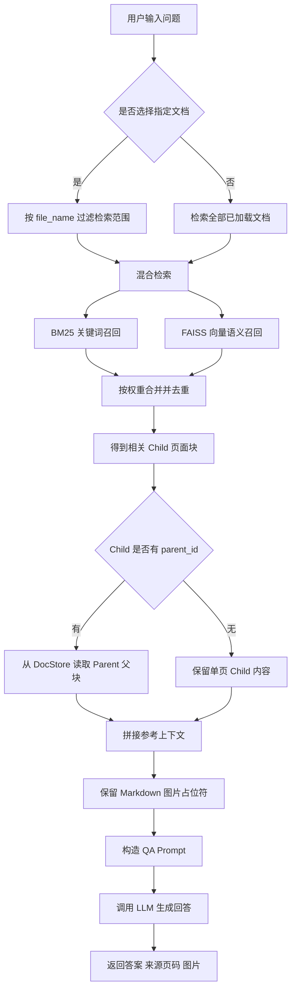

# 文档 RAG 智能问答系统

基于 RAG 的智能文档问答系统，支持 PPT、PDF、文本和图片格式，支持图文并茂的回答，让用户通过问答快速查询文档内容。

## 特性

- **多格式支持**:
  - PPT/PPTX: 自动提取文本和图片
  - PDF: 提取文档文本内容
  - 文本文件: 支持 .txt, .md, .log 等格式
  - 图片: 支持 .jpg, .png, .gif 等格式，使用 Vision API 分析内容
- **标题生成**: LLM 为无标题页面生成标题
- **图片处理**: 提取图片保存到本地，通过 ImageServer 提供 HTTP 访问
- **页面合并**: LLM 判定连续页面是否合并 + 手动标记 (`<START_BLOCK>`/`<END_BLOCK>`)，合并连续的相关页面（父子分块架构）
- **父子分块**:
   - Child: 每页内容 → FAISS 向量库
   - Parent: 合并内容 → DocStore (JSON 文件)
- **混合检索**: BM25 关键词 + Vector 语义搜索，可动态调整权重
- **图文并茂**: 回答中保留 Markdown 图片链接
- **参考来源**: 清晰标注参考页码


## 技术栈

| 组件 | 选择 |
|------|------|
| LLM 框架 | LangChain |
| LLM 模型 | OpenAI API 兼容接口 |
| Embeddings | OpenAI Embeddings (兼容接口) |
| 向量库 | FAISS |
| DocStore | LocalFileStore (JSON 文件) |
| 前端 | Streamlit |
| 图片存储 | 本地 HTTP 服务器 |

## 架构



## 目录结构

```
pptx-rag/
├── app/                    # Streamlit 前端
│   └── streamlit_app.py    # 主应用入口
├── src/                    # 核心代码
│   ├── config.py           # 配置管理
│   ├── models.py           # Pydantic 数据模型
│   ├── logging.py          # 日志配置
│   ├── parser/             # 文档解析层
│   │   ├── base_parser.py  # 解析器基类
│   │   ├── pptx_parser.py  # PPT 解析
│   │   ├── pdf_parser.py   # PDF 解析
│   │   ├── text_parser.py  # 文本解析
│   │   ├── image_parser.py # 图片解析
│   │   └── image_handler.py # 图片处理
│   ├── processor/          # 内容处理层
│   │   ├── title_generator.py   # 标题生成
│   │   ├── chunking.py           # 子块创建
│   │   ├── merger.py             # 页面合并判断
│   │   └── parent_builder.py     # 父块构建
│   ├── storage/            # 存储层
│   │   ├── vector_store.py # FAISS 向量库
│   │   └── doc_store.py    # 父块文档存储
│   ├── retriever/          # 检索层
│   │   ├── hybrid_retriever.py  # 混合检索
│   │   └── parent_retriever.py  # 父块检索
│   ├── rag/                # RAG 核心
│   │   └── chain.py        # 主处理链
│   └── server/             # 服务
│       └── image_server.py # 图片 HTTP 服务器
├── data/                   # 数据目录
│   ├── uploads/            # 上传文件
│   ├── images/             # 图片存储
│   ├── chunks/             # 父块 JSON 文件
│   ├── indexes/            # FAISS 索引
│   └── logs/               # 日志文件
├── tests/
├── .env                    # 环境配置
├── requirements.txt
└── README.md
```

## 安装

```bash
# 克隆项目
cd pptx-rag

# 创建虚拟环境（推荐）
python -m venv venv
source venv/bin/activate  # Linux/Mac
# 或 venv\Scripts\activate  # Windows

# 安装依赖
pip install -r requirements.txt

# 配置 API 密钥（见下方配置部分）
```

## 配置

复制 `.env.example` 为 `.env` 并修改：

```env
# API 配置 (OpenAI 兼容接口)
API_BASE_URL=https://api.openai.com/v1  # 或你的自定义 API 端点
API_KEY=sk-your-api-key-here
LLM_MODEL=gpt-4  # 或你的自定义模型名称
EMBEDDING_MODEL=text-embedding-3-large  # 或你的自定义 embedding 模型

# 数据目录
DATA_DIR=./data

# 图片服务端口
IMAGE_SERVER_PORT=8080

# 检索设置
RETRIEVAL_K=2
RETRIEVAL_K_MULTIPLIER=2

# 检索权重 (BM25 + Vector = 1.0)
BM25_WEIGHT=0.4
VECTOR_WEIGHT=0.6

# LLM 设置
LLM_TEMPERATURE=0.1
LLM_NUM_CTX=4096
LLM_NUM_PREDICT=2048
```

**支持的 API 接口：**
- OpenAI 官方 API
- 阿里云通义千问 (DashScope)
- 智谱 AI (GLM)
- 任何 OpenAI 兼容的 API 端点

## 使用

```bash
# 启动应用
streamlit run app/streamlit_app.py
```

访问 `http://localhost:8501` 即可使用。

### 使用流程

1. **上传文档**: 侧边栏上传文档文件（支持 PPT、PDF、文本、图片）
2. **自动处理**: 点击"处理文档"，系统自动解析、提取内容
3. **开始问答**: 在主界面输入问题
4. **查看回答**: 获得图文并茂的回答和参考来源

### 示例问题（PLC故障判断培训.pptx）

仓库根目录包含示例文档 `PLC故障判断培训.pptx`。处理该文档后，可以尝试以下问题验证检索、父子分块和图片召回效果：

- `PLC系统中 S7-200 和 S7-300 系列分别用在哪些设备上？请结合图片说明它们的主要模块和指示灯。`
- `PLC运行故障诊断时，需要重点查看哪些指示灯？如果有相关示意图，请一起展示。`
- `PLC电源故障诊断应该关注哪些位置？请引用文档中的图片辅助说明。`
- `PLC系统架构示例包含哪些组成部分？请按第14到16页的内容总结，并保留相关架构图片。`
- `当机台启动后，如何通过输入输出指示灯判断是PLC模块问题还是现场连接问题？`
- `请总结这份PLC故障判断培训文档中，PLC现状、系统架构和故障诊断三部分的核心内容。`

### 用户提问后的查询逻辑

用户在页面输入问题后，系统不会直接把问题交给 LLM，而是先从知识库中召回相关页面，再扩展为父块上下文，最后生成带来源和图片的回答。



关键点：

- **BM25 + Vector 双路召回**：BM25 适合精确术语，向量检索适合理解相近语义。
- **Child 检索，Parent 回答**：检索阶段用单页子块提高命中精度，回答阶段替换成连续页面父块，减少上下文碎片。
- **图片保留**：如果父块内容包含 ``，Prompt 会要求 LLM 原样保留，前端即可渲染图片。
- **来源页码**：系统从父块或单页上下文标记中解析页码，随回答一起返回。

### 支持的文件格式

| 格式 | 扩展名 | 说明 |
|------|--------|------|
| PowerPoint | .pptx, .ppt | 提取文本和图片 |
| PDF | .pdf | 提取文档文本 |
| 文本 | .txt, .md, .markdown, .log, .text | 按行分块处理 |
| 图片 | .jpg, .jpeg, .png, .gif, .bmp, .webp, .tiff | Vision API 分析内容 |

### 界面功能

- **文档管理**: 查看已加载的文档列表
- **问答设置**:
  - 选择特定文档或所有文档
  - 调整 BM25/向量检索权重
  - 设置检索结果数量
  - 调整 LLM Temperature
- **清空文档**: 清除所有已加载的文档

## 核心设计

### 父子分块架构

- **Child Chunk (子块)**: 每页内容，向量化后存入 FAISS 用于检索
- **Parent Chunk (父块)**: 合并后的连续多页内容，存入 DocStore 用于 LLM 回答

### 页面合并策略

1. **LLM 判定**: 使用 LLM 判断连续页面是否属于同一主题
2. **手动标记**: 在 PPT 备注中添加 `<START_BLOCK>` 和 `<END_BLOCK>` 强制合并

### 图片处理流程

1. 提取 PPT 中的图片，保存到 `data/images/{hash}/`
2. 启动本地 HTTP 服务器提供图片访问
3. 在文本中插入 `` 占位符
4. 前端 Markdown 渲染时自动显示图片

### 去重机制

同一文件重复上传时，系统自动：
1. 删除该文件在 DocStore 中的所有父块
2. 删除向量库中的所有相关 chunks
3. 删除对应的图片目录
4. 删除上传的 PPT 文件
5. 重新处理新文件

## 后续扩展

- [ ] MinIO 图片存储（替代本地文件系统）
- [ ] Redis/MongoDB DocStore（替代本地 JSON）
- [ ] Chroma/Milvus 向量库（替代 FAISS）
- [ ] 混合查询后，增加Rerank模型进行精排
- [ ] 用户认证
- [ ] 文档删除（按文件名选择性删除）
